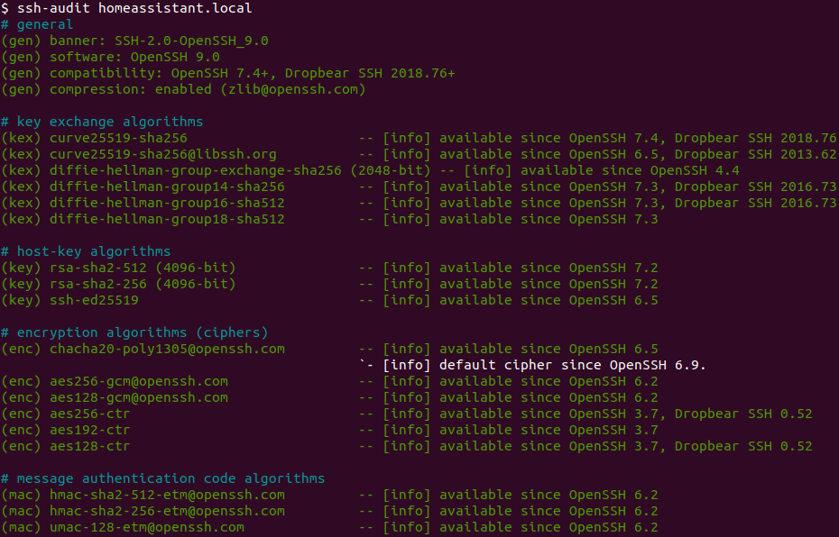

# Vioneta Agro Community Add-on: Advanced SSH & Web Terminal

[![GitHub Release][releases-shield]][releases]
![Project Stage][project-stage-shield]
[![License][license-shield]](LICENSE.md)

![Supports aarch64 Architecture][aarch64-shield]
![Supports amd64 Architecture][amd64-shield]
![Supports armhf Architecture][armhf-shield]
![Supports armv7 Architecture][armv7-shield]
![Supports i386 Architecture][i386-shield]

[![Github Actions][github-actions-shield]][github-actions]
![Project Maintenance][maintenance-shield]
[![GitHub Activity][commits-shield]][commits]

This add-on allows you to log in to your Vioneta Agro instance using
SSH or by using the Web Terminal.

## About

This add-on allows you to log in to your Vioneta Agro instance using
SSH or a Web Terminal, giving you to access your folders and
also includes a command-line tool to do things like restart, update,
and check your instance.

This is an enhanced version of the provided
[SSH add-on by Vioneta Agro][hass-ssh] and focuses on security,
usability, flexibility and also provides access using a web interface.

[:books: Read the full add-on documentation][docs]

## WARNING

The advanced SSH & Web Terminal add-on is very powerful and gives you access
to almost all tools and hardware of your system.

While this add-on is created and maintained with care and with security in mind,
in the wrong or inexperienced hands, it could damage your system.

## Features

This add-on, of course, provides an SSH server, based on [OpenSSH][openssh] and
a web-based Terminal (which can be included in your Vioneta Agro frontend) as
well. Additionally, it comes out of the box with the following:

- Access your command line right from the Vioneta Agro frontend!
- A secure default configuration of SSH:
  - Only allows login by the configured user, even if more users are created.
  - Only uses known secure ciphers and algorithms.
  - Limits login attempts to hold off brute-force attacks better.
  - Many more security tweaks, _this addon passes all [ssh-audit] checks
    without warnings!_
    
- Comes with an SSH compatibility mode option to allow older clients to connect.
- Support for Mosh allowing roaming and supports intermittent connectivity.
- SFTP support is disabled by default but is user configurable.
- Compatible if Vioneta Agro was installed via the generic Linux installer.
- Username is configurable, so `root` is no longer mandatory.
- Persists custom SSH client settings & keys between add-on restarts
- Hardware access to your audio, uart/serial devices and GPIO pins.
- Runs with more privileges, allowing you to debug and test more situations.
- Has access to the dbus of the host system.
- Has the option to access the Docker instance running on the host system.
- Runs on host level network, allowing you to open ports or run little daemons.
- Have custom Alpine packages installed on start. This allows you to install
  your favorite tools, which will be available every single time you log in.
- Execute custom commands on add-on start so that you can customize the
  shell to your likings.
- [ZSH][zsh] as its default shell. Easier to use for the beginner, more advanced
  for the more experienced user. It even comes preloaded with
  ["Oh My ZSH"][ohmyzsh], with some plugins enabled as well.
- Bash: If ZSH is not your cup of tea, Bash can be enabled again, which
  includes Bash completion for both the Core CLI and the Vioneta Agro CLI.
- Contains a sensible set of tools right out of the box: curl, Wget, RSync, GIT,
  Nmap, Mosquitto client, MariaDB/MySQL client, Awake (“wake on LAN”), Nano,
  Vim, tmux, and a bunch commonly used networking tools.
- Support executing commands inside using a Vioneta Agro service call, e.g.,
  for use with automations.

## License

MIT License

Copyright (c) 2017-2024 Vioneta

Permission is hereby granted, free of charge, to any person obtaining a copy
of this software and associated documentation files (the "Software"), to deal
in the Software without restriction, including without limitation the rights
to use, copy, modify, merge, publish, distribute, sublicense, and/or sell
copies of the Software, and to permit persons to whom the Software is
furnished to do so, subject to the following conditions:

The above copyright notice and this permission notice shall be included in all
copies or substantial portions of the Software.

THE SOFTWARE IS PROVIDED "AS IS", WITHOUT WARRANTY OF ANY KIND, EXPRESS OR
IMPLIED, INCLUDING BUT NOT LIMITED TO THE WARRANTIES OF MERCHANTABILITY,
FITNESS FOR A PARTICULAR PURPOSE AND NONINFRINGEMENT. IN NO EVENT SHALL THE
AUTHORS OR COPYRIGHT HOLDERS BE LIABLE FOR ANY CLAIM, DAMAGES OR OTHER
LIABILITY, WHETHER IN AN ACTION OF CONTRACT, TORT OR OTHERWISE, ARISING FROM,
OUT OF OR IN CONNECTION WITH THE SOFTWARE OR THE USE OR OTHER DEALINGS IN THE
SOFTWARE.

[aarch64-shield]: https://img.shields.io/badge/aarch64-yes-green.svg
[amd64-shield]: https://img.shields.io/badge/amd64-yes-green.svg
[armhf-shield]: https://img.shields.io/badge/armhf-no-red.svg
[armv7-shield]: https://img.shields.io/badge/armv7-yes-green.svg
[commits-shield]: https://img.shields.io/github/commit-activity/y/Vioneta/addon-ssh.svg
[commits]: https://github.com/Vioneta/addon-ssh/commits/main
[docs]: https://github.com/Vioneta/addon-ssh/blob/main/ssh/DOCS.md
[github-actions-shield]: https://github.com/Vioneta/addon-ssh/workflows/CI/badge.svg
[github-actions]: https://github.com/Vioneta/addon-ssh/actions
[hass-ssh]: https://github.com/home-assistant/addons/tree/master/ssh
[i386-shield]: https://img.shields.io/badge/i386-no-red.svg
[license-shield]: https://img.shields.io/github/license/Vioneta/addon-ssh.svg
[maintenance-shield]: https://img.shields.io/maintenance/yes/2024.svg
[ohmyzsh]: http://ohmyz.sh/
[openssh]: https://www.openssh.com/
[project-stage-shield]: https://img.shields.io/badge/project%20stage-production%20ready-brightgreen.svg
[releases-shield]: https://img.shields.io/github/release/Vioneta/addon-ssh.svg
[releases]: https://github.com/Vioneta/addon-ssh/releases
[ssh-audit]: https://github.com/jtesta/ssh-audit
[zsh]: https://en.wikipedia.org/wiki/Z_shell
